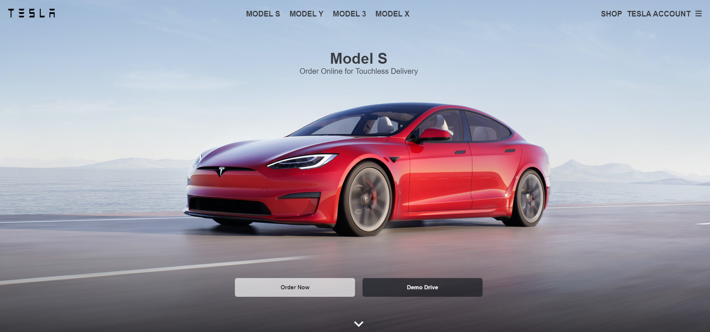

# Tesla-Clone

A web Application that replicates the Tesla Website

This project is a web application that replicates the basic features and design of the Tesla website, the official website of the leading electric vehicle company. It uses HTML, CSS, and JavaScript to create a responsive and interactive user interface that allows the user to browse and learn more about the Tesla products.

Here's a live deployment - https://tesla-clone-ic41.onrender.com

<center>
    
</center>

## Features

- The application mimics the layout and style of the Tesla website, with a logo, a navigation bar and a footer.
- The application displays different sections for each Tesla product in a vertical scrollable list.

## Installation and Usage

To install and run this project, you need to have a web browser (such as Chrome or Firefox) that supports HTML, CSS, and JavaScript.

To download the code and assets for this project, you can clone this GitHub repository using the following command:

```git clone https://github.com/Amritha-07/Tesla-Clone.git```

To start the application

```npm start```

## References

- [🔴 Building the Tesla Clone with ReactJS (Redux + Styled Components)](https://www.youtube.com/watch?v=lUeS9Wsj6dk)